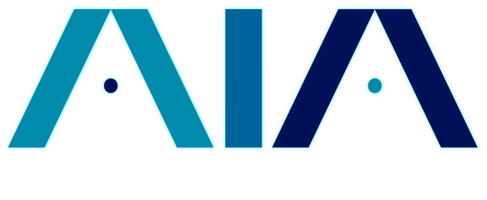

# AI-Interview-Assistant 5.0
[Visit Our Website](https://aiinterviewassistant.com)   

## Downloads
[Download the Excel PCF component 1st](https://github.com/dtsoden/dtsoden-AI-Interview-Assistant/raw/main/BTDExportExcel_1_0_0_1.zip)  
[Download the Power Platform Solution File](https://github.com/dtsoden/dtsoden-AI-Interview-Assistant/raw/main/InterviewAIAssistant.zip)  
[Optionally download the Power BI Report](https://github.com/dtsoden/dtsoden-AI-Interview-Assistant/raw/main/AIA%20Taxonomy%20Report.pbix)

## Setup Instructions
- Import the Download to EXCEL PCF Component Solution file BTDExportExcel_1_0_0_1.zip into your Power Platform Environment
- Import the Power Platform Solution File into your Power Platform Environment
- Open the "AI Interview Assistant" Solution
- Locate the custom connector and open it, then select to edit it.
- Go to step "3. Definition"
- Scroll all the way to the bottom and locate "Policy (1)"
- Select the only policy called "Authorization" and edit the line that says "Header value *" and paste in your OpenAI key with Bearer "SK-***your_key***"  
- Update the connector

### DO NOT MISS THIS STEP
- When editing the canvas app the 1st time you likely will have to add in the custom connector "Custom_OpenAI" to the app. I do not knnow why it does this, but it will show lots of errors if you miss this step and the app won't work without it

## How to Install Video Step-By-Step (click picture to watch)

