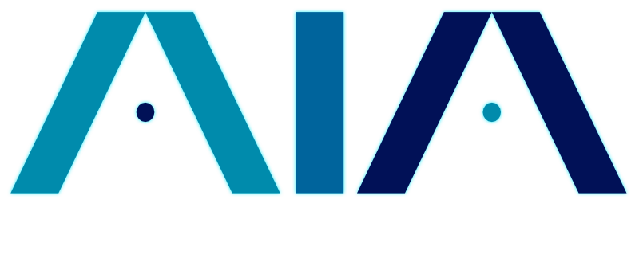

# AI-Interview-Assistant
[Visit Our Website](https://aiinterviewassistant.com)   |  [Download the Power Platform Solution File](https://raw.githubusercontent.com/dtsoden/AI-Interview-Assistant/main/InterviewAIAssistant_2_0_0_5.zip)

## Setup
- Import the Solution into your Power Platform Environment
- Open the "AI Interview Assistant" Solution
- Locate the custom connector and open it, then select to edit it.
- Go to step "3. Definition"
- Scroll all the way to the bottom and locate "Policy (1)"
- Select the only policy called "Authorization" and edit the line that says "Header value *" and paste in your OpenAI key with Bearer "SK-***your_key***"  
- Update the connector

### Notes
- When editing the canvas app the 1st time you likely will have to add in the custom connector "Custom_OpenAI" to the app. I do not knnow why it does this, but it will show lots of errors if you miss this step and the app won't work without it

